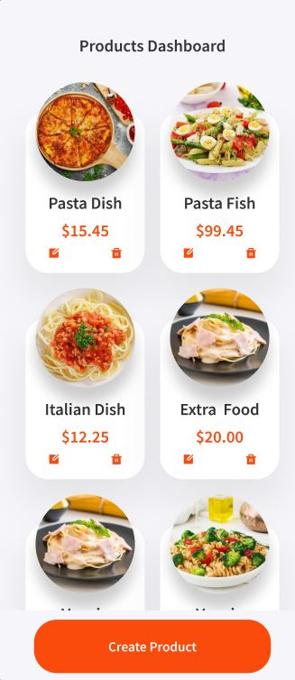
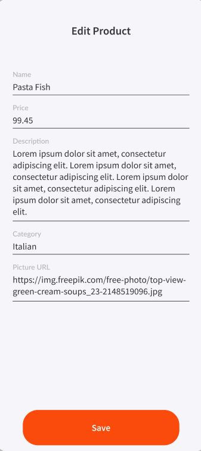
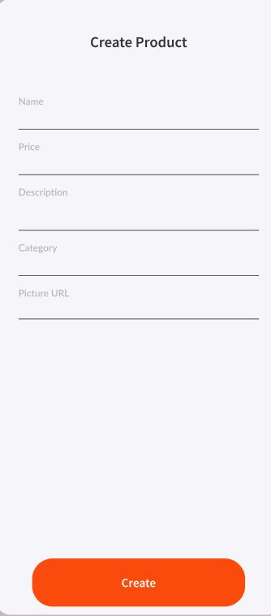
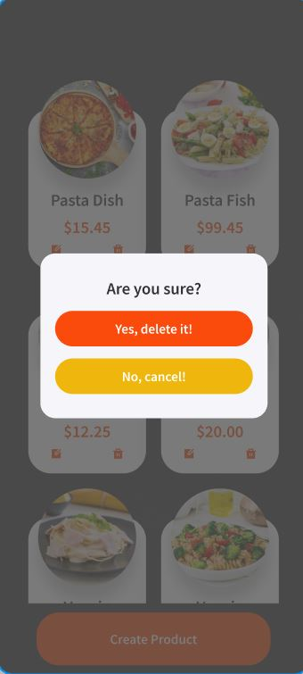

# Project: Eatable

## Objective

Build the MVP of a dashboard web app for different dishes.

## Initial Configuration 

Before starting the server, you need to run:

### `npm install`

Then, in the project directory, you can run:

### `npm start`

Runs the app in the development mode.\
Open [http://localhost:3000](http://localhost:3000) to view it in your browser.

## Details

## Features:

- **Everyone can see all the products**
- **Everyone can edit all the products**
- **Everyone can create a product**
- **Everyone can delete any product**